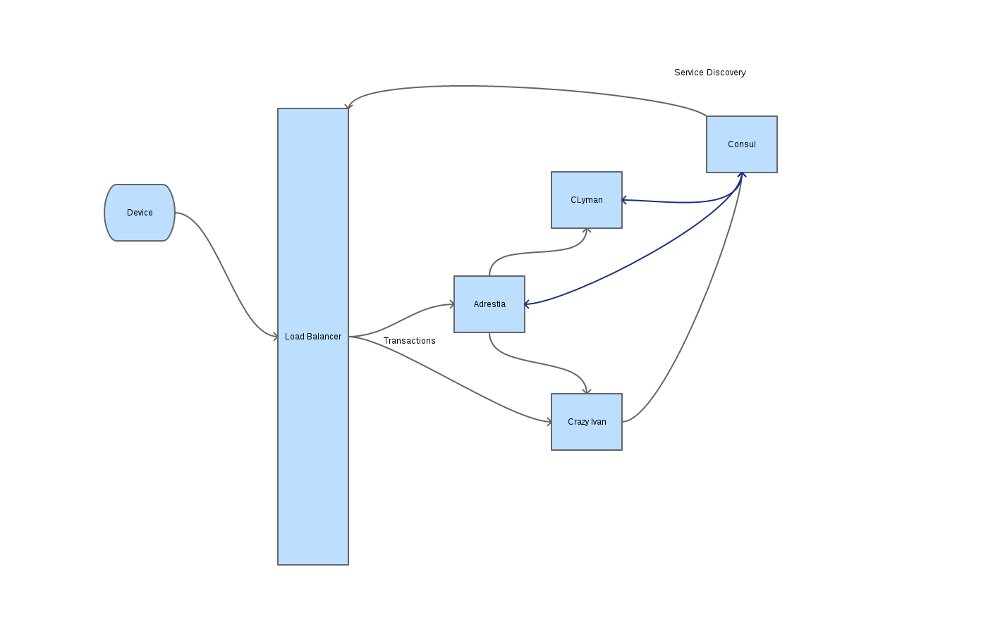
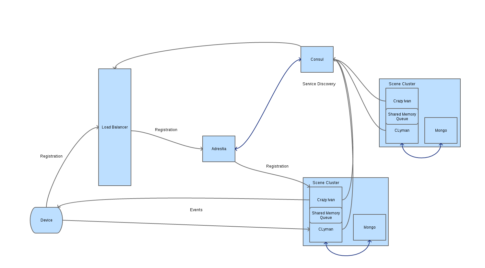
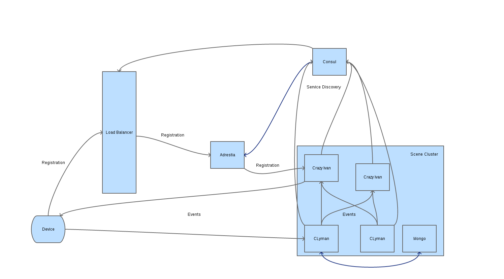

Aesel Zero Latency Streaming Design
===================================

Section 1: Abstract
-------------------

This document outlines the design for Phase 3 of the Distributed
Visualization Server.  This effort has multiple focuses:

1. Allow for deployment configurations which support zero-latency event processing.
2. Allow end-to-end HTTPS encryption of transactions.
3. Enable transaction network to utilize existing load balancers.

One of the primary benefits that Aesel provides is as a back-end server
that can be deployed across cloud networks, with enough speed to power
a traditional multi-player video game.  A single-server deployment should be
capable of meeting the performance requirements, but not scalability.  However,
due to the expected network latencies present within the network of a cloud
provider, we are not able to guarantee that such a deployment will meet
the performance requirements.  We need to support a cloud-native, zero-latency
solution.

As a part of this enhancement, we will be introducing several new concepts, outlined
in the Vocabulary section below.

Section 2: Vocabulary
---------------------

.. include:: insert/vocab.rst

The following components are utilized within phase 3 of development:

+-------------------------------+-------------+-------------------------------------------------------------------------------------------------------------------------------------------------------+
| Type                          | Name        | Description                                                                                                                                           |
+-------------------------------+-------------+-------------------------------------------------------------------------------------------------------------------------------------------------------+
| Cluster Manager               | Adrestia    | Tracks available Scene Clusters, deciding which instance manages which Scene(s).  Handles routing of requests for Objects and Scene Registrations.    |
+-------------------------------+-------------+-------------------------------------------------------------------------------------------------------------------------------------------------------+
| Data Storage                  | Mongo       | Storage of text-based data to hold Mesh data, Shader data, etc                                                                                        |
+-------------------------------+-------------+-------------------------------------------------------------------------------------------------------------------------------------------------------+
| Transformation Updates        | Clyman      | Storage for Object Transformations with real-time change feeds                                                                                        |
+-------------------------------+-------------+-------------------------------------------------------------------------------------------------------------------------------------------------------+
| Scenes & Coordinate Systems   | CrazyIvan   | Tracks sets of objects & user devices which form scenes to know what to load. Tracks coordinate systems to resolve the differences between devices.   |
+-------------------------------+-------------+-------------------------------------------------------------------------------------------------------------------------------------------------------+

Section 3: Events & Transactions
--------------------------------

Events and Transactions are the means by which clients make changes to the state
of an Aesel Scene.  Generally, events are used to update an active scene (ie. live
updates during games or simulations), while transactions are used for inactive scenes.
This is not, however, a hard rule.

The difference between events and transactions comes down to one of consistency vs speed.
In cases where speed is critical (such as live updates during games/simulations), events
become the preferred method of communication.  In other cases, transactions offer stronger
consistency guarantees at the cost of more time spent making the request.  Each client
is expected to make use of both APIs, at various times throughout their lifecycle.

Section 3.1: Transactions
~~~~~~~~~~~~~~~~~~~~~~~~~

A transaction generally passes through an external load balancer, and is routed
to either the Crazy Ivan or Adrestia.  Scene API requests are passed directly to
Crazy Ivan.  In the case of Object updates, Adrestia
forwards the message on to the correct instance of CLyman.

In the case of Scene Registration messages, Adrestia does the same but may need
to decide which cluster is acting as a primary for the given scene.  Either way,
it then responds with the address of the cluster to which a device has been assigned.
The device can use this interface to send in events to the cluster.

Section 3.2: Events
~~~~~~~~~~~~~~~~~~~

An event is sent directly from the client to a CLyman instance, via an exposed
UDP port (more details in section 4).  Events are currently limited to a simple
Object update, overwriting the transformation, location, and scale of the object.
Future development work will expand on the Event API to provide configurable event
types and event stream logic.

Because we are only supporting single-object events in the implementation, we
do not have to worry about cross-scene and cross-cluster events until the next
phase of development.

Section 4: Zero-Latency Deployments
-----------------------------------

Zero-latency means that there can be submillisecond network latency incurred
from receipt of an Object Update (as detailed in the Aesel High Speed Streaming
Design), to output of the Change Stream to other registered devices.

To accomplish this, CLyman and CrazyIvan can be deployed with several types of
event streams: in memory, udp, and kafka.  These strategies vary in terms of
speed vs reliability.

Section 4.1: In-Memory Streaming
~~~~~~~~~~~~~~~~~~~~~~~~~~~~~~~~

In-memory streaming involves a block of shared memory for CLyman and Crazy Ivan,
that is used as a queue.  This is the fastest method of deployment, but also the
least flexible.  Each physical server should have one pair of CLyman and Crazy Ivan
running, and each pair can manage separate scenes.

Section 4.2: UDP Streaming
~~~~~~~~~~~~~~~~~~~~~~~~~~

UDP Streaming involves CLyman instances sending UDP messages to Crazy Ivan instances
within the same cluster.  This provides a good mix of speed and scalability, as
CLyman and Crazy Ivan can be scaled horizontally within a cluster.

Section 4.3: In-Memory Caching
~~~~~~~~~~~~~~~~~~~~~~~~~~~~~~

In-memory caching can be used to prevent repeated network calls within Crazy Ivan

* On receipt of kafka update, add scene to time-expired cache of scene ID's
* Check Scene-Device cache (seperate, time-expired cache of scene ID's and device info) for scene
* If not present, execute query & populate. If configured to still send updates, do so
* If present, send update
* On background thread, periodically query Neo4j and populate Scene-Device cache
* Crazy Ivan should always keep in memory those scenes in it's region (per region-specific server pairs)

Section 4.4: CLyman UDP Endpoint
~~~~~~~~~~~~~~~~~~~~~~~~~~~~~~~~

CLyman needs to be able to accept Object Overwrite messages via UDP, mimicking the
UDP API exposed by Adrestia.

Section 4.5: Region-Specific Server Pairs
~~~~~~~~~~~~~~~~~~~~~~~~~~~~~~~~~~~~~~~~~

Clyman/CrazyIvan pairs will need to be able to register as pairs with Consul,
making them distinct enough to register the pairing within Adrestia.  They will
also need to register to the specified region.

Adrestia will need to provide the address of particular pairs of CLyman/CrazyIvan
to devices upon registration.  The devices can then send UDP updates directly to
CLyman.  Adrestia will also need logic to provide alternate server pairs upon request
when devices detect that the server is down.

Section 5: Required Changes
---------------------------

* Update CLyman and CrazyIvan to use HTTP(S) interfaces rather than ZMQ
* Add UDP Endpoint to CLyman
* Add configurable options for event stream in CLyman and Crazy Ivan (Kafka, UDP, Shared Memory)
* Add logic in Adrestia to maintain mapping of Scenes-clusters
* Add configurable logic in Adrestia to pass UDP endpoints to devices
* Add Scene-Device Caching logic in CrazyIvan so no DB calls need to be made
* Logic in Adrestia to provide an updated UDP endpoint to devices on failure
