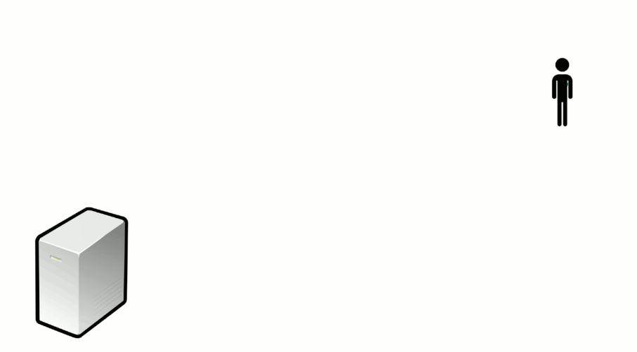
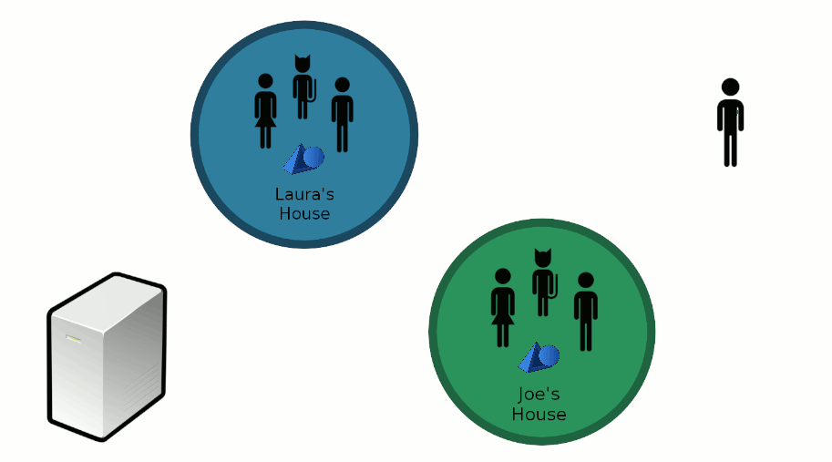
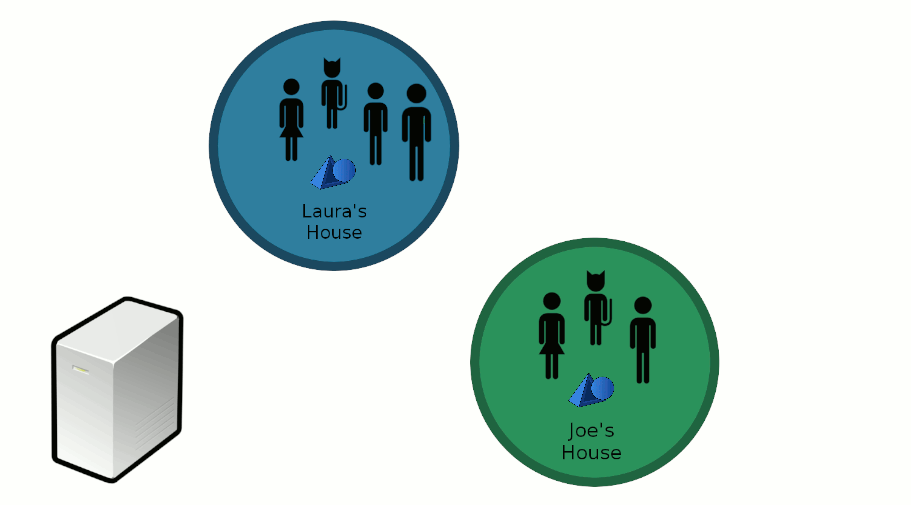
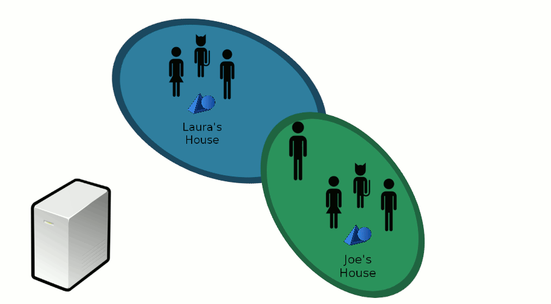

.. _overview:

What is Aesel
=============

Aesel builds on top of a traditional video game server by tracking relationships between coordinate systems.  This is a critical
component when supporting Augmented Reality clients who are rendering these objects on top of a view of real space.  In this case,
we can't assume that all of the devices are referencing the same origin point, as well as x, y, and z directions.  Aesel gives a
means of storing these transformations and calculating the transformations wherever possible.

.. note::
   It is not required to utilize this functionality, meaning Aesel will function perfectly well as a traditional video game
   server, or in any other scenario which involves multiple users interacting with 3-dimensional objects.  We will make
   special note of those steps in the workflow which are unnecessary for non-Augmented Reality clients.

Scene Registration
~~~~~~~~~~~~~~~~~~

Whether we are building an Augmented Reality, Virtual Reality, traditional game console, or other application,
our first step is to ask Aesel for information on scenes that are available.  A scene is simply a logical grouping
of objects which devices can move between, so they can correspond to different physical locations (in a typical AR application),
different independent games (in a typical VR/PC/Console game)

This amounts to executing a :ref:`Scene <vocab>` Query.  We can look for scenes based on names, regions, and tags,
or we can look for scenes within a specific distance of our latitude/longitude.

For example:

.. include:: _examples/scene/scene_query.rst

Joining a game or walking into a new area is represented by a Scene Registration.
Aesel responds to this message by informing you about all of the objects in the scene, as well as
any other information you need to render the scene as a whole.  We download all of the
data we need to actually visualize the 3D objects from the server.

This exchange of information is initiated by a Scene Registration message:

.. include:: _examples/scene/scene_register.rst

After Registration, there may be a great deal of communication between the user's device and the Aesel server.  Rather than
dumping all of the necessary information directly to the device, Aesel simply responds to a registration with the keys to
find both it's :ref:`Assets <vocab>` and :ref:`Objects <vocab>`.  The client then responds with load messages for these records,
so it loads each file on the server until the device has everything it needs.  For a more detailed explanation of the process involved
in loading a scene, please see the :ref:`Loading a Scene <loading>` page.

Scene Synchronization
~~~~~~~~~~~~~~~~~~~~~

.. note::
   Scene Synchronization is only required for Augmented Reality applications, where each device
   cannot be provided on start-up with a pre-defined coordinate system for the scene (as is generally
   the case in standard gaming/animation and Virtual Reality)

In this stage, we need to correct our view with that of everyone else.  This can be done any number of ways (from a real reference
object to device-device communication), but once the right adjustments are made we send this information back to Aesel.

The message to Aesel takes the form of a Scene Synchronization Message:

.. include:: _examples/scene/scene_sync.rst

We need to perform this step to determine the difference between the default coordinate system of your device, and the
coordinate system of the :ref:`Scene <vocab>`.  This is the coordinate system that all of the objects are stored in,
and that your device will need to use when referencing the scene.  Think of it this way: If I tell you that there is
a cube located at the point (1, 2, 3), how do you know where (0, 0, 0) is?  If we don't agree, then we'll end up seeing
the cube in different places.

Object Updates
~~~~~~~~~~~~~~

Now, we can move around any of the virtual objects we downloaded right in front of us.  When we do, that information is
sent to Aesel and, from there, to everyone else in the scene.

Here we utilize the Object Streaming API to move the object around:

.. include:: _examples/object/object_hsupdate.rst

Aesel provides live change feeds of :ref:`Object <vocab>` location, rotation, and scaling for any
users registered to the :ref:`Scene <vocab>` containing that :ref:`Object <vocab>`.  These feeds
are designed to be extremely high-speed, and are sent via UDP.

.. note::
   Live Change feeds are the heart-and-soul of Aesel, and continually stream the current transformation
   matrix of the objects to all registered devices in real-time.  Clients who are running live simulations
   or games will only interact through this API until the game/simulation ends.

Cross-Registration
~~~~~~~~~~~~~~~~~~

.. note::
   Cross-Registration is only required for Augmented Reality applications, where each device
   cannot be provided on start-up with a pre-defined coordinate system for the scene (as is generally
   the case in standard gaming/animation and Virtual Reality)

When entering another, different physical location, we send another registration
message to Aesel.  And, just like before, we need to correct our view with that of everyone else.

This time, Aesel sees that you've corrected two different scenes that you've moved between,
and it uses this information to calculate a general correction that can be used by anyone else going
between these two scenes.  This means that, if anyone else wants to change from one of these scenes
to another, they will be provided with the correct transformation upon registration.

De-Registration
~~~~~~~~~~~~~~~

We finish by de-registering from the first scene, as we no longer need to recieve updates on the objects
in that scene.  This can be done after moving out of a physical area in an Augmented Reality application,
or when leaving a game in a Virtual Reality or standard gaming application.

This message to Aesel comes as a De-Registration Message:

.. include:: _examples/scene/scene_deregister.rst

Notice that we only de-register after performing any corrections needed, and once we are synchronized
we can leave the original scene.  Also note that we do not necessarily need to leave the original scene.
We may also remain registered and continue receiving updates on all objects in both scenes.
